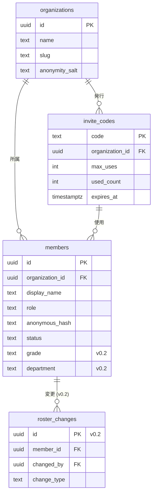
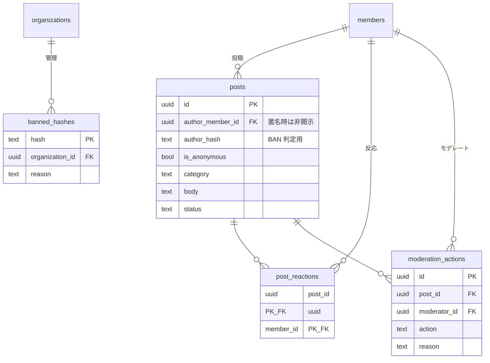
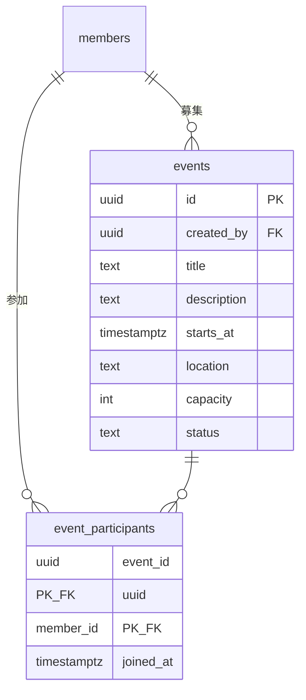
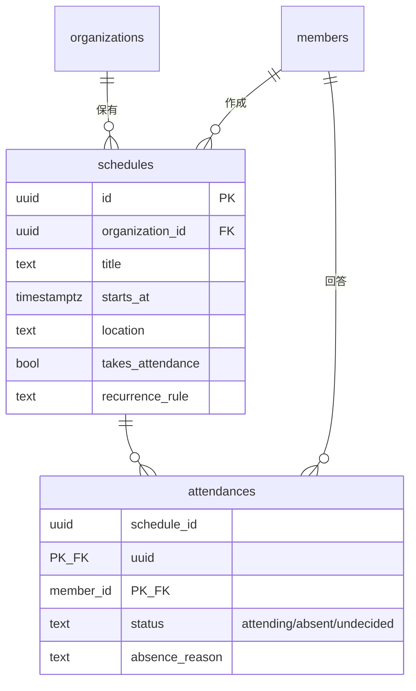

# YUWA データモデル ER 図

> **作成日**: 2026-05-25
> **作成者**: 青木（PO）
> **目的**: 要件定義 v0.1 と v0.2 のテーブル関係を視覚化し、エンジニアが全体像を素早く掴めるようにする
> **形式**: Mermaid `erDiagram`（GitHub 上でそのままレンダリングされる）
> **更新方針**: スキーマ確定時に追従。実装中の変更も随時反映

---

## 1. v0.1 + v0.2 全体 ER 図

```mermaid
erDiagram
    organizations ||--o{ invite_codes : "発行"
    organizations ||--o{ members : "所属"
    organizations ||--o{ posts : "保有"
    organizations ||--o{ events : "保有"
    organizations ||--o{ schedules : "保有 (v0.2)"
    organizations ||--o{ banned_hashes : "管理"

    invite_codes ||--o{ members : "使用"

    members ||--o{ posts : "投稿"
    members ||--o{ post_reactions : "反応"
    members ||--o{ events : "募集"
    members ||--o{ event_participants : "参加"
    members ||--o{ moderation_actions : "実行 (運営)"
    members ||--o{ schedules : "作成 (v0.2)"
    members ||--o{ attendances : "回答 (v0.2)"
    members ||--o{ roster_changes : "変更対象 (v0.2)"
    members ||--o{ banned_hashes : "BAN 実行 (運営)"

    posts ||--o{ post_reactions : "反応される"
    posts ||--o{ moderation_actions : "モデキューで処理"

    events ||--o{ event_participants : "参加表明"

    schedules ||--o{ attendances : "出欠回答 (v0.2)"

    organizations {
        uuid id PK
        text name
        text slug
        text anonymity_salt "匿名ハッシュ用"
        timestamptz created_at
    }

    invite_codes {
        text code PK
        uuid organization_id FK
        uuid issued_by FK
        int max_uses
        int used_count
        timestamptz expires_at
        timestamptz created_at
    }

    members {
        uuid id PK "auth.users.id と一致"
        uuid organization_id FK
        text display_name
        text role "member/moderator/admin"
        timestamptz joined_at
        text invite_code FK
        text anonymous_hash "SHA256(id+salt)"
        text status "active/suspended/left"
        text grade "B1-M2/OB (v0.2)"
        text department "(v0.2)"
        text bio "(v0.2)"
        text contact_email "(v0.2)"
    }

    posts {
        uuid id PK
        uuid organization_id FK
        uuid author_member_id FK "匿名時もDBには記録するがAPIで非開示"
        text author_hash "BAN・違反履歴用"
        bool is_anonymous
        text category "request/idea/other"
        text body
        text status "pending/approved/rejected/edit_requested"
        uuid approved_by FK
        timestamptz approved_at
        timestamptz created_at
    }

    post_reactions {
        uuid post_id PK_FK
        uuid member_id PK_FK
        timestamptz created_at
    }

    events {
        uuid id PK
        uuid organization_id FK
        uuid created_by FK
        text title
        text description
        timestamptz starts_at
        text location
        int capacity
        text status "open/closed/cancelled"
        timestamptz created_at
    }

    event_participants {
        uuid event_id PK_FK
        uuid member_id PK_FK
        timestamptz joined_at
    }

    moderation_actions {
        uuid id PK
        uuid post_id FK
        uuid moderator_id FK
        text action "approve/reject/request_edit/ban_hash"
        text reason
        timestamptz created_at
    }

    banned_hashes {
        text hash PK
        uuid organization_id FK
        uuid banned_by FK
        text reason
        timestamptz created_at
    }

    schedules {
        uuid id PK "v0.2"
        uuid organization_id FK
        text title
        text description
        timestamptz starts_at
        timestamptz ends_at
        text location
        uuid created_by FK
        bool takes_attendance
        text recurrence_rule "RFC 5545 RRULE"
        text status "scheduled/cancelled"
        timestamptz created_at
    }

    attendances {
        uuid schedule_id PK_FK "v0.2"
        uuid member_id PK_FK
        text status "attending/absent/undecided"
        text absence_reason
        timestamptz responded_at
    }

    roster_changes {
        uuid id PK "v0.2"
        uuid member_id FK
        uuid changed_by FK
        text change_type "role_changed/status_changed/profile_updated"
        text before_value "JSON"
        text after_value "JSON"
        text reason
        timestamptz created_at
    }
```

---

## 2. 機能ブロック別の図

### 2.1 認証 / メンバー管理（v0.1 + v0.2）



### 2.2 匿名意見箱（v0.1）



### 2.3 イベント掲示板（v0.1）



### 2.4 出欠・スケジュール管理（v0.2）



---

## 3. 重要な設計判断と注意点

### 3.1 events と schedules を別テーブルにしている理由
- **events**: 外部イベント（ハッカソン・勉強会等）への同行者募集
- **schedules**: 部の予定（部会・ミーティング等）への出欠管理
- 用途・UI が異なるため別テーブル。エンジニア合流時に統合判断は再検討の余地あり（要件 v0.2 §5 参照）

### 3.2 匿名性の DB レベル防御
- `posts.author_member_id` は匿名投稿でも DB には記録される
- ただし **API ハンドラレベルで** `is_anonymous = true` の場合は運営にも返さない
- RLS（Row Level Security）で SELECT を制限することも検討
- `posts.author_hash` のみ運営向け UI に表示（先頭 4 文字のみ）

### 3.3 退会時のデータ取り扱い
- `members.status = 'left'` に変更
- `members.display_name` は「(退会済)」に置き換え
- 過去の **記名投稿は匿名化されて保持**（部の意思決定の文脈を残すため）
- 詳細は規約 第 7 条参照

### 3.4 BAN の仕組み
- `banned_hashes` に hash を追加 → 以後その匿名 ID からの投稿は拒否
- 投稿者本人は特定されない（ハッシュのみ）
- 「同じ人が荒らしてる」ことだけ識別可能

### 3.5 監査ログ
- `moderation_actions`: 投稿への運営アクション履歴
- `roster_changes`: 名簿変更の履歴（v0.2）
- 両方とも「誰が・いつ・何を・なぜ」を記録、運営の透明性を担保

---

## 4. インデックス推奨（実装時の参考）

```sql
-- 頻繁にクエリされる想定のインデックス

-- 公開済み投稿の時系列取得
CREATE INDEX idx_posts_org_status_created
  ON posts (organization_id, status, created_at DESC);

-- カテゴリフィルタ付き取得
CREATE INDEX idx_posts_org_category_created
  ON posts (organization_id, category, created_at DESC)
  WHERE status = 'approved';

-- 募集中イベント
CREATE INDEX idx_events_org_status_starts
  ON events (organization_id, status, starts_at);

-- 今後のスケジュール
CREATE INDEX idx_schedules_org_starts
  ON schedules (organization_id, starts_at)
  WHERE status = 'scheduled';

-- メンバーの出欠状況
CREATE INDEX idx_attendances_member_schedule
  ON attendances (member_id, schedule_id);

-- BAN チェック（投稿時に毎回参照）
CREATE INDEX idx_banned_hashes_org_hash
  ON banned_hashes (organization_id, hash);
```

---

## 5. 関連ドキュメント

- 要件定義 v0.1（§5 データモデル詳細）: [`requirements-v0.1.md`](requirements-v0.1.md)
- 要件定義 v0.2 ドラフト（§5 v0.2 追加分）: [`requirements-v0.2.md`](requirements-v0.2.md)
- 利用規約 v1 ドラフト（データ取り扱い）: [`legal/terms-of-service-v1-draft.md`](legal/terms-of-service-v1-draft.md)
